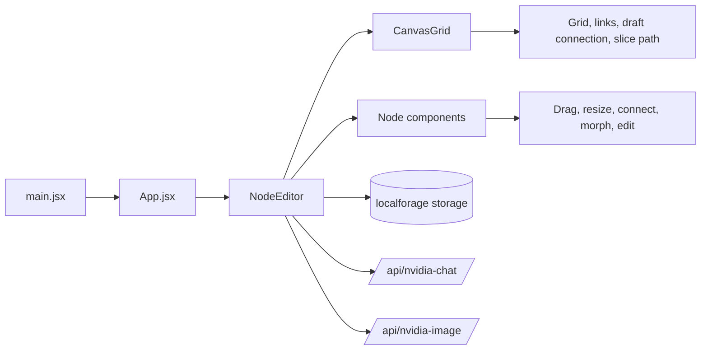
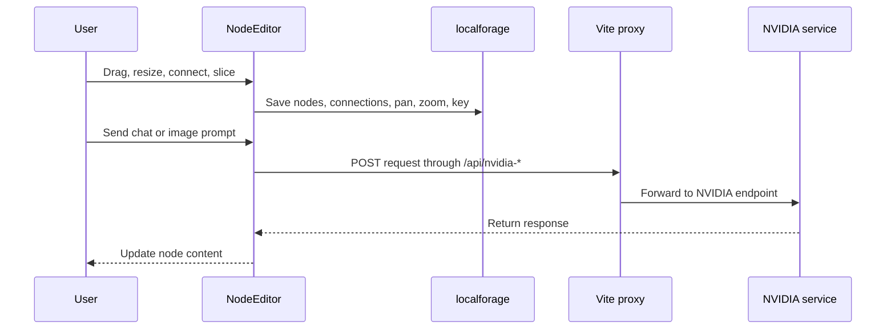

# Warpline

Warpline is a full-screen node canvas for building connected workspaces. The app is designed around live graph editing: you create nodes, drag them around a zoomable canvas, connect them with routed links, slice connections away, and keep the whole workspace persisted in the browser.

This README focuses on how the project works at runtime, not on the setup process.

The diagrams below are Mermaid blocks, so they can be rendered in GitHub or pasted into mermaid.live.

## What The App Does

Warpline runs as a React app on top of Vite. The actual workspace lives in one editor component that owns the graph state, the canvas transform, local persistence, and the optional service-backed node actions.

The UI is split into two layers:

- A canvas layer that draws the grid, connection paths, and slice gestures.
- A DOM overlay that renders the interactive nodes themselves.

That split keeps the workspace smooth when the graph gets larger, because the heavy visual routing is drawn once on a canvas instead of being recreated as many DOM elements.

## Runtime Flow



## Main Pieces

### `src/main.jsx`

Bootstraps React and mounts the app into `#root`.

### `src/App.jsx`

Acts as a tiny wrapper that hands control to `NodeEditor`.

### `src/components/NodeEditor.jsx`

This is the center of the application. It owns:

- `nodes` and `connections`
- the live connection draft while dragging a port
- the slice path used to remove connections
- pan and zoom state for the workspace transform
- the settings modal and API key storage
- import and export of `.warpline` workspaces
- chat and image request handling

### `src/components/CanvasGrid.jsx`

Draws the dotted grid, all connection paths, the draft connection, and the slice gesture overlay. It also applies the current pan and zoom refs so the drawn graph stays aligned with the node layer.

### `src/components/Node.jsx`

Renders the interactive nodes and handles most node-level behavior:

- dragging
- resizing
- delete actions
- the morph menu for changing node type
- chat input
- image prompt input
- file upload for document nodes

### `src/utils/math.js`

Contains the geometry helpers used for connection routing and hit testing. The important part is the orthogonal path generation that keeps links readable around other nodes.

### `src/utils/animations.js`

Provides the small snap spark effect used when a connection is completed or sliced.

## Workspace Behavior

### Pan And Zoom

The canvas can be panned and zoomed without rebuilding the whole scene.

- Hold space or use the middle mouse button to pan.
- Use Ctrl or Cmd plus the wheel to zoom.
- The zoom button in the top-left shows the current zoom level or a fit label after a fit-to-view action.
- Double-clicking a node triggers a fit-to-nodes view.

### Node Creation

There are two ways to create a raw node:

1. Click empty space on the canvas.
2. Drag a connection from a port and release it in empty space.

Both flows snap the new node to the 40px grid.

### Connections

Connections are directional and are drawn as orthogonal routed lines with curved corners. The canvas layer calculates the path by intersecting the source and target rectangles, routing around the workspace, and then applying a light warp effect near nearby nodes.

Connection rules are enforced in the editor:

- A node cannot connect to itself.
- Input nodes cannot receive connections.
- Image nodes cannot send connections.
- Duplicate connections are rejected.

Dragging across a connection slices it out of the graph. When a slice hits a link, the app plays a spark effect and removes that connection.

### Node Editing

Nodes are movable and resizable from all sides and corners. When unlocked, each node also shows:

- a close button for deletion
- a connect port on the right edge
- a floating morph menu that can turn a raw node into a chat, image, or input node

Triple-clicking a node toggles its lock state. Locked nodes cannot be dragged, resized, or deleted.

## Node Types

### Raw Node

This is the default node type. It starts as a blank block and can be morphed into a specialized node.

### Chat Node

Chat nodes provide an input box and a message stream. When a message is sent:

- the editor stores the user message immediately
- a temporary typing bubble appears
- the editor gathers context from connected upstream nodes
- the request is sent through the local Vite proxy to the NVIDIA chat endpoint
- the response is written back into the node and appended to its summary history

Chat nodes can inherit context from connected chat nodes and input nodes upstream.

### Image Node

Image nodes accept a prompt and display the generated image. When the prompt is submitted:

- the editor marks the node as generating
- upstream context is folded into the prompt if available
- the request is sent through the local Vite proxy to the NVIDIA image endpoint
- the returned base64 image is stored as the node's current image
- a prompt and image history is kept in the node data

### Input Node

Input nodes are document sources. They let the user load text-based files such as `.txt`, `.csv`, `.md`, `.json`, `.js`, `.py`, and `.jsx`. Their file contents can then feed downstream context.

## Data And Persistence

The editor persists workspace state with `localforage` so the canvas comes back exactly as it was after a refresh.

Saved state includes:

- nodes
- connections
- pan
- zoom
- the stored API key

Import and export use the custom `.warpline` format. Exporting keeps the graph structure and node metadata, but generated image payloads are stripped so the file stays lightweight.



## Service Flow

The Vite dev server proxies two local routes:

- `/api/nvidia-chat` -> `https://integrate.api.nvidia.com`
- `/api/nvidia-image` -> `https://ai.api.nvidia.com`

The editor uses those routes so the browser talks to the local dev server while the dev server forwards the request to the external service.

## Project Map

- `src/main.jsx` starts the React tree.
- `src/App.jsx` passes control into the editor.
- `src/components/NodeEditor.jsx` owns the workspace state and actions.
- `src/components/CanvasGrid.jsx` draws the canvas scene.
- `src/components/Node.jsx` renders the interactive node UI.
- `src/utils/math.js` handles routing and intersection math.
- `src/utils/animations.js` handles the spark effect.

## Development

```bash
npm run dev
```

That is enough to run the workspace in development mode. `npm run build` and `npm run preview` are available for production checks.
